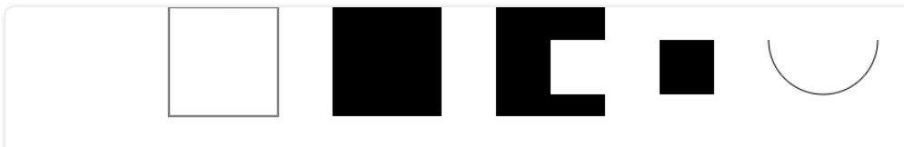

# Html
HTML (HyperText Markup Language) 不是一门编程语言，而是一种用来告知浏览器如何组织页面的标记语言。
## Canvas 画布
[canvas]画布，是一个可以使用脚本(通常为JavaScript)来绘制图形的 HTML 元素。

```javascript
<!-- 未设置大小 默认大小为：300 x 150 (像素) -->
    <canvas width="2000" height="500" id="canvas">
        当前浏览器不支持canvas元素，请升级或更换浏览器！
    </canvas>
    <script>
        // api =>getContext() 获取渲染上下文和绘画功能
        let canvasElement = document.getElementById('canvas')
        if (canvasElement.getContext) {
            // 2d：建立一个二维渲染上下文
            let ctx = canvasElement.getContext('2d')
            console.log('🚀 => ctx:', ctx);
            // webgl（或 experimental-webgl）： 创建一个 WebGLRenderingContext 三维渲染上下文对象
            let webgl = canvasElement.getContext('webgl')
            // webgl2（或 experimental-webgl2）：创建一个 WebGL2RenderingContext 三维渲染上下文对象
            let webgl2 = canvasElement.getContext('webgl2')
            /*
            绘制直线
            */
            // 设置初始位置
            ctx.moveTo(10, 0)
            // 绘制一条初始位置到指定位置的直线
            ctx.lineTo(100, 100)
            //通过线条来绘制图形轮廓
            ctx.stroke()
            /*
            绘制矩形
            */
            // strokeRect(x, y, width, height) 是用来绘制一个矩形的边框，x和y 是矩形的起点坐标，width和height 是矩形的宽高
            ctx.strokeRect(150, 0, 100, 100)
            // fillRect(x, y, width, height) 绘制一个填充的矩形，x和y 是矩形的起点坐标，width和height 是矩形的宽高
            ctx.fillRect(300, 0, 100, 100)
            // clearRect(x, y, width, height) 清除指定矩形区域，让清除部分完全透明，x和y 是矩形的起点坐标，width和height 是矩形的宽高
            ctx.fillRect(450, 0, 100, 100)
            ctx.fillRect(500, 30, 150, 50)
            // 中间白色的矩形就是被指定清除的区域
            ctx.clearRect(500, 30, 100, 50)
            /*
            绘制圆弧和圆
            */
            //arc(x, y, radius, startAngle, endAngle, anticlockwise)。
            // x和Y为圆心的坐标，radius为半径，
            // startAngle为圆弧或圆的开始位置，
            // endAngle为圆弧或圆的结束位置，
            // anticlockwise是绘制的方向（不写默认为false，从顺时针方向）
            ctx.arc(750, 30, 50, 0, Math.PI, false)
            ctx.stroke()
        }
    </script>
```

